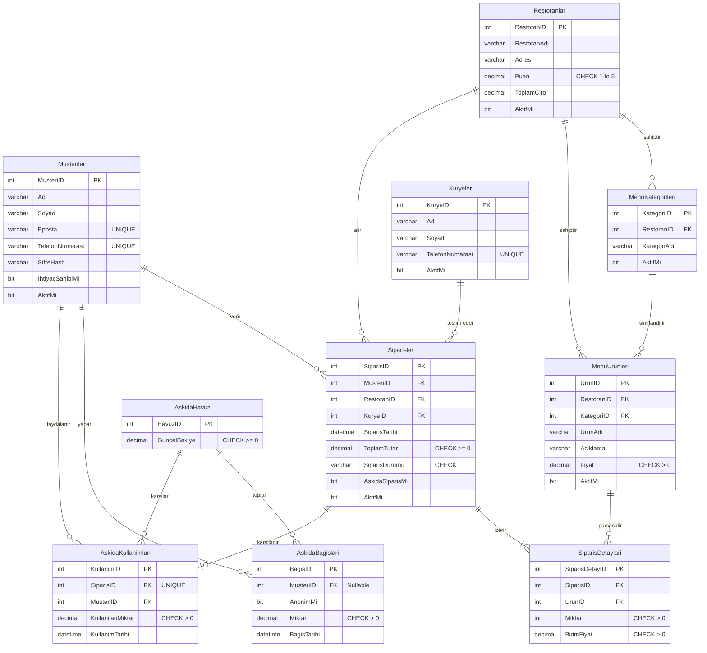

# VTYS-1 Projesi: Varlık-İlişki (ER) Diyagramı

Aşağıdaki şema, platformdaki tabloları, Primary Key (PK) & Foreign Key (FK) bağıntılarını ve ilişki kardinalitelerini (1:N vb.) göstermektedir.

```mermaid
erDiagram
    Musteriler ||--o{ Siparisler : "verir"
    Musteriler ||--o{ AskidaBagislari : "yapar"
    Musteriler ||--o{ AskidaKullanimlari : "faydalanir"
    
    Restoranlar ||--o{ MenuKategorileri : "sahiptir"
    Restoranlar ||--o{ MenuUrunleri : "sahiptir"
    Restoranlar ||--o{ Siparisler : "alir"
    
    MenuKategorileri ||--o{ MenuUrunleri : "siniflandirir"
    
    Kuryeler ||--o{ Siparisler : "teslim eder"
    
    Siparisler ||--|{ SiparisDetaylari : "icerir"
    MenuUrunleri ||--o{ SiparisDetaylari : "parcasidir"
    
    Siparisler ||--o| AskidaKullanimlari : "karsilanir"
    
    AskidaHavuz ||--o{ AskidaBagislari : "toplar"
    AskidaHavuz ||--o{ AskidaKullanimlari : "karsilar"

    Musteriler {
        int MusteriID PK
        varchar Ad
        varchar Soyad
        varchar Eposta "UNIQUE"
        varchar TelefonNumarasi "UNIQUE"
        varchar SifreHash
        bit IhtiyacSahibiMi
        bit AktifMi
    }

    Restoranlar {
        int RestoranID PK
        varchar RestoranAdi
        varchar Adres
        decimal Puan "CHECK 1 to 5"
        decimal ToplamCiro
        bit AktifMi
    }

    MenuKategorileri {
        int KategoriID PK
        int RestoranID FK
        varchar KategoriAdi
        bit AktifMi
    }

    MenuUrunleri {
        int UrunID PK
        int RestoranID FK
        int KategoriID FK
        varchar UrunAdi
        varchar Aciklama
        decimal Fiyat "CHECK > 0"
        bit AktifMi
    }

    Kuryeler {
        int KuryeID PK
        varchar Ad
        varchar Soyad
        varchar TelefonNumarasi "UNIQUE"
        bit AktifMi
    }

    Siparisler {
        int SiparisID PK
        int MusteriID FK
        int RestoranID FK
        int KuryeID FK
        datetime SiparisTarihi
        decimal ToplamTutar "CHECK >= 0"
        varchar SiparisDurumu "CHECK"
        bit AskidaSiparisMi
        bit AktifMi
    }

    SiparisDetaylari {
        int SiparisDetayID PK
        int SiparisID FK
        int UrunID FK
        int Miktar "CHECK > 0"
        decimal BirimFiyat "CHECK > 0"
    }

    AskidaBagislari {
        int BagisID PK
        int MusteriID FK "Nullable"
        bit AnonimMi
        decimal Miktar "CHECK > 0"
        datetime BagisTarihi
    }

    AskidaHavuz {
        int HavuzID PK
        decimal GuncelBakiye "CHECK >= 0"
    }

    AskidaKullanimlari {
        int KullanimID PK
        int SiparisID FK "UNIQUE"
        int MusteriID FK
        decimal KullanilanMiktar "CHECK > 0"
        datetime KullanimTarihi
    }
```
